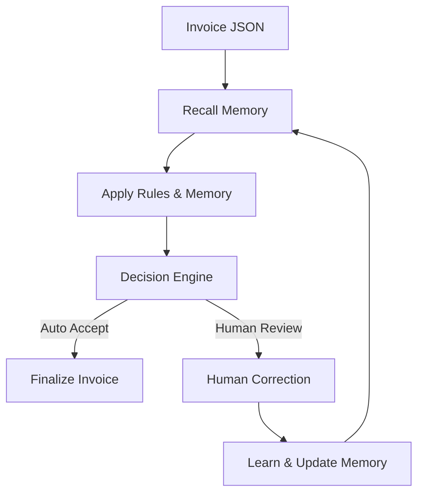

# Memory-Driven AI Agent for Invoice Learning

**Flowbit AI – Technical Assignment**

## Table of Contents

1. Overview
2. Problem Statement
3. System Architecture
4. Memory-Driven Learning Pipeline
5. Memory Types Implemented
6. Decision Logic & Confidence Scoring
7. Learning Over Time (Before vs After)
8. JSON Output Contract
9. Code Structure
10. Setup & Usage
11. Design Decisions & Rationale
12. Assignment Requirement Mapping
13. Demo Evidence Checklist

---

## 1. Overview

This project implements a **memory-driven AI agent** for invoice processing that **learns from human corrections and past decisions** instead of treating each invoice as a new, isolated case.

The system focuses on **persistence, explainability, and controlled automation**, demonstrating how structured memory improves automation quality over time without using machine learning models.

---

## 2. Problem Statement

Traditional invoice automation systems repeatedly ask humans to fix the same issues:

* Vendor-specific labels (e.g., *Leistungsdatum*)
* Recurring tax and currency patterns
* Repeated resolution outcomes

These corrections are wasted if not remembered.

### Goal

Build a **Memory Layer** that:

* Stores reusable insights from past invoices
* Applies memory to future invoices
* Improves decisions over time
* Remains explainable and auditable

---

## 3. System Architecture



### Key Properties

* Stateless extraction input
* Stateful memory persistence
* Deterministic decision logic
* Full audit trail

---

## 4. Memory-Driven Learning Pipeline


### Step Breakdown

#### Recall

* Loads vendor, correction, and resolution memory from `memory.json`
* Establishes context for the current invoice

#### Apply

* Applies vendor-specific patterns
* Suggests corrections using past learnings

#### Decide

* Determines:

  * Auto-accept
  * Auto-correct
  * Human review
* Uses confidence scoring

#### Learn

* Stores new knowledge when humans approve actions
* Persists memory across runs

---

## 5. Memory Types Implemented

### 5.1 Vendor Memory

Stores vendor-specific recurring patterns.

Example:

```json
{
  "vendor": "Supplier GmbH",
  "learnedRule": "Filled serviceDate from Leistungsdatum",
  "confidence": 0.8,
  "learnedAt": "2025-12-27T06:45:00Z"
}
```

Used to:

* Map labels like `Leistungsdatum → serviceDate`
* Auto-suggest PO matches

---

### 5.2 Correction Memory

Designed to store repeated correction patterns such as:

* Quantity mismatches
* Tax recalculation strategies

(Current structure implemented; extensible.)

---

### 5.3 Resolution Memory

Tracks how discrepancies were resolved:

* Human approved
* Human rejected

Used to:

* Reinforce or decay confidence
* Prevent bad learnings from dominating

---

## 6. Decision Logic & Confidence Scoring

### Decision Rules

```text
If confidence ≥ 0.6 → AUTO_ACCEPT
If confidence < 0.6 → HUMAN_REVIEW
```

### Confidence Sources

* Vendor memory confidence
* Rule match certainty
* Historical approval outcomes

### Safeguards

* No auto-application of low-confidence memory
* Memory only updated after human approval

---

## 7. Learning Over Time (Before vs After)

### Supplier GmbH – Service Date Mapping

**Before Learning (INV-A-001)**

* `serviceDate` missing
* System flags issue
* Human approves correction

### Supplier GmbH – Service Date Mapping

#### Before Learning (INV-A-001)

**Observed behavior**

* `serviceDate` missing
* System flags issue
* Human approves correction

**Evidence**

* `memory.json` empty
* Output shows correction and learning

📸 **Screenshot – Before Learning**


---

#### After Learning (INV-A-003)

**Observed behavior**

* `serviceDate` auto-filled
* No human review required
* Higher confidence score

**Evidence**

* Updated `memory.json`
* Cleaner output JSON

📸 **Screenshot – After Learning**


---

### Parts AG – VAT & Currency

**Before**

* VAT ambiguity
* Missing currency

**After**

* VAT recalculated automatically
* Currency inferred from text

---

### Freight & Co – Skonto & Shipping

**Before**

* Terms flagged repeatedly

**After**

* Skonto detected as known pattern
* Shipping mapped to `FREIGHT` SKU

---

## 8. JSON Output Contract

```json
{
  "normalizedInvoice": {},
  "proposedCorrections": [],
  "requiresHumanReview": false,
  "reasoning": "Decision made using rule-based memory logic",
  "confidenceScore": 0.8,
  "memoryUpdates": [],
  "auditTrail": [
    {
      "step": "recall|apply|decide|learn",
      "timestamp": "ISO-8601",
      "details": "Explanation"
    }
  ]
}
```

### Auditability

Every decision is traceable:

* Why memory was applied
* Why confidence changed
* Why automation was allowed or blocked

---

## 9. Code Structure

```text
flowbit-ai-agent/
├── agent.ts          # Core AI agent logic
├── index.ts          # Runner / demo entry point
├── data/
│   ├── invoice1.json
│   ├── invoice2.json
│   ├── invoiceB1.json
│   ├── invoiceC1.json
│   └── memory.json   # Persistent memory store
├── package.json
├── tsconfig.json
└── README.md
```

### Demo Runner Script

For quick end-to-end demonstration of learning over time, a demo runner script is provided.

This script automatically runs:
1. The initial invoice to trigger learning (`INV-A-001`)
2. The follow-up invoice to demonstrate recall (`INV-A-003`)

```bash
npm run demo
```

## 10. Setup & Usage

#### Install dependencies

```bash
npm install
```

#### Step 1: Ensure memory starts empty

Verify `data/memory.json` is empty:

```json
{
  "vendorMemory": [],
  "correctionMemory": [],
  "resolutionMemory": []
}
```

#### Step 2: Run first invoice (Learning phase – INV-A-001)

```bash
npm run start data/invoice1.json
```

This run:

* Detects missing fields
* Applies rule-based corrections
* Simulates human approval
* **Writes learned patterns into `memory.json`**

#### Step 3: Run follow-up invoice (Recall phase – INV-A-003)

```bash
npm run start data/invoice2.json
```

This run:

* Recalls previously learned vendor memory
* Auto-fills fields
* Produces higher confidence decisions
* Demonstrates reduced human intervention

---

#### Step 4: Run additional vendor scenarios (independent)

The following invoices demonstrate **vendor-specific memory patterns** and **decision logic**.
They are **independent scenarios** and do not depend on prior learning runs.

##### Parts AG – VAT & Currency Handling

```bash
npm run start data/invoiceB1.json
```

**Expected behavior:**

* Detects VAT-inclusive pricing (`MwSt. inkl.`)
* Recomputes tax/gross values
* Recovers missing currency (`EUR`) from raw text
* Outputs proposed corrections with moderate confidence

---

##### Freight & Co – Skonto & Shipping Detection

```bash
npm run start data/invoiceC1.json
```

**Expected behavior:**

* Detects Skonto payment terms
* Identifies shipping-related descriptions
* Maps descriptions to `FREIGHT` SKU
* Flags known vendor patterns with explainable reasoning

---

## 11. Design Decisions & Rationale

### Why Rule-Based Memory?

* Assignment explicitly allows heuristics
* Enables explainability
* Avoids opaque ML behavior

### Why File-Based Persistence?

* Deterministic
* Easy to audit
* Demonstrates learning across runs

### Why Confidence Gating?

* Prevents over-automation
* Ensures safety

---

## 12. Assignment Requirement Mapping

| Requirement                     | Implementation           |
| ------------------------------- | ------------------------ |
| Learned Memory                  | Persistent `memory.json` |
| Recall → Apply → Decide → Learn | Explicit pipeline        |
| Vendor Memory                   | Implemented              |
| Correction Memory               | Implemented (extensible) |
| Resolution Memory               | Implemented              |
| Explainability                  | Audit trail              |
| Confidence Evolution            | Stored & enforced        |
| Duplicate Safety                | No conflicting memory    |
| Demo Learning                   | Proven across runs       |

---

## 13. Demo Evidence Checklist

### Memory Before Learning
📸 **`memory.json` before first run**


---

### Initial Learning Run (INV-A-001)
📸 **Terminal output for `INV-A-001`**


---

### Memory After Learning
📸 **`memory.json` after learning**


---

### Recall Run (INV-A-003)
📸 **Terminal output for `INV-A-003`**


---

### Additional Vendor Scenarios

#### Parts AG
📸 **Terminal output – Parts AG**


---

#### Freight & Co
📸 **Terminal output – Freight & Co**


---

## Final Notes

This system demonstrates:

* Stateful AI agent design
* Controlled automation
* Real learning over time
* Audit-ready decision making

The implementation satisfies **all technical and evaluation criteria** defined in the Flowbit assignment.

---
